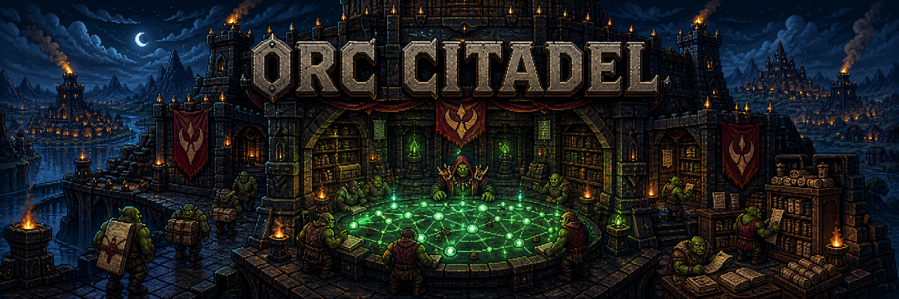

# Orc Citadel



> **The Camp works. The Citadel remembers.**
>
> 수백만 개의 공개 문서에서 시간과 출처가 보존된 주장 지식 그래프를 구축하고, LLM 에이전트가 그래프의 공백과 모순을 조사해 지속적으로 확장하는 **Temporal Evidence Intelligence 플랫폼**.

---

## 개요

**Orc Citadel**은 `Global Evidence Observatory` 콘셉트를 구현하는 프로젝트다. 뉴스, 기업 공시, 정부 문서, 연구 논문, 공식 발표 등 대량의 공개 자료를 수집·분석하여 다음을 연결한다.

- 누가 어떤 주장을 했는가
- 주장이 어떤 대상·사건에 관한 것인가
- 어떤 자료가 주장을 지지하거나 반박하는가
- 여러 출처가 실제로 서로 독립적인가
- 사실과 주장이 시간에 따라 어떻게 변했는가
- 현재 결론의 불확실성과 아직 조사되지 않은 영역은 무엇인가

일반적인 검색·RAG가 "관련 문서를 찾아 답변을 생성"하는 데 집중한다면, Orc Citadel은 **문서에서 검증 가능한 주장(Claim)을 추출하고 그 관계를 시간 기반 Knowledge Graph로 축적하는 것**을 핵심으로 한다.

최종 산출물은 단순한 자연어 답변이 아니라 세 가지를 함께 제공한다.

1. 조사 결과 보고서
2. 결론을 구성한 Evidence Graph
3. 모든 주장과 원문 구절 사이의 provenance(출처 계보)

## 왜 필요한가

대규모 공개 정보 환경에는 다음 문제가 있다.

- 동일한 보도자료가 수백 개 기사로 복제되어 독립 근거처럼 보인다.
- 서로 다른 표기 탓에 같은 인물·기업·제품이 별개 대상으로 인식된다.
- 과거에는 참이던 사실과 현재 사실이 충돌하는 것처럼 보인다.
- 사실, 당사자 주장, 기자 해석, 미래 예측이 뒤섞여 있다.
- 생성형 모델의 보고서는 문장 단위로 출처를 감사하기 어렵다.
- 새 증거가 나와도 기존 결론이 자동으로 갱신되지 않는다.

Orc Citadel은 문서를 최종 단위로 취급하지 않고, 문서 내부의 **주장·증거·사건·엔터티·출처 계보**를 구조화한 뒤 새 자료가 들어올 때 영향을 받는 그래프와 결론만 증분 갱신한다.

## 핵심 특성

- **Temporal Knowledge Graph** — 관계를 Claim 노드로 reification 하고, `SUPPORTS` / `CONTRADICTS` / `QUALIFIES` / `SUPERSEDES` 등으로 증거 구조를 표현한다.
- **Bitemporal 모델** — `valid time`(현실에서 사실이 유효한 기간)과 `transaction time`(시스템이 관찰·저장한 기간)을 모두 보존해 변화 이력을 재현한다.
- **Provenance-first** — 모든 그래프 요소는 `extraction → normalized doc → source span → immutable raw → source URL`로 원문까지 왕복 추적 가능하다.
- **출처 독립성 판정** — 하나의 근원에서 파생된 문서를 클러스터로 축소해 독립 증거 수를 과대평가하지 않는다.
- **계층적 LLM 사용** — 규칙·임베딩·소형 모델·고성능 LLM을 단계별 비용/가치에 따라 라우팅한다.
- **Evidence-first Generation** — 보고서를 먼저 쓰고 출처를 붙이지 않는다. 검증된 subgraph를 먼저 확정하고 그 범위 안에서만 문장을 생성한다.

## 세계관 용어 ↔ 기술 개념

세계관 명칭은 UX·시각 표현에 쓰고, API·스키마·운영 문서에서는 괄호 안 기술 용어를 병기한다.

| 세계관 명칭 | 기술 개념 | 역할 |
| --- | --- | --- |
| **Citadel** | 전체 플랫폼 | 수집·저장·그래프·조사·감사를 통합하는 중앙 본부 |
| **Scouts** | Source connectors | 외부 자료·변경 사항 수집 |
| **Grand Archive** | Data lakehouse | 원본·정규화·curated 데이터 보존 |
| **Hall of Witnesses** | Evidence & provenance store | 주장↔원문 구절, 출처 계보 연결 |
| **War Table** | Temporal Evidence Knowledge Graph | 엔터티·사건·주장·증거·시간 관계 탐색 |
| **Chronicle** | Bitemporal event history | 사실·주장·시스템 인식의 변경 이력 보존 |
| **Lorekeepers** | Resolution pipeline | Entity Resolution & Claim Canonicalization |
| **Seers** | LLM reasoning agents | 모순·공백·반증·새로운 조사 경로 추론 |
| **Warchief's Council** | Multi-agent investigation | 서로 다른 역할의 Agent가 증거 검토·종합 |
| **Signal Spire** | Change alerts | 결론·confidence의 중요한 변화 알림 |
| **Campaign** | Investigation | 하나의 질문에 대한 범위·조사 실행 이력 |

## 아키텍처 (개략)

```text
Sources
  → Scouts / Ingestion Queue
  → Immutable Raw Storage
  → Parse / Normalize / Language Detection
  → Exact & Near-Duplicate Detection
  → Grand Archive / Lakehouse
  → Entity & Claim Candidate Extraction
  → Lorekeepers / Entity Resolution / Claim Canonicalization
  → War Table / Temporal Evidence Knowledge Graph
  → Search & Vector Index
  → Warchief's Council / Research Agents
  → Chronicle / Report / Graph Explorer
  → Signal Spire / Alerts
```

**권장 기술 스택**(초기 → 확장):

| 용도 | 초기 구성 | 확장 구성 |
| --- | --- | --- |
| 원본·Lakehouse | MinIO + Parquet | S3 + Iceberg |
| Batch 처리 | Ray Data | Ray Data / Spark |
| Event stream | PostgreSQL queue | Kafka / Redpanda |
| 메타데이터 | PostgreSQL | PostgreSQL |
| Knowledge Graph | Neo4j Community | Neo4j/Memgraph |
| 전문·벡터 검색 | OpenSearch | OpenSearch cluster |
| 분석·관측 | PostgreSQL/Grafana | ClickHouse + Grafana |
| API | FastAPI | FastAPI + async workers |
| 배포 | Docker Compose | Kubernetes |

> 기술을 한꺼번에 도입하지 않는다. **데이터 규모와 측정된 병목이 분리를 정당화할 때만** 구성 요소를 추가한다.

## 초기 도메인

첫 버전은 범위가 명확하고 공개 자료가 풍부한 **AI 반도체·데이터센터 공급망** 산업 하나를 선택한다. 대표 조사 질문 예:

- 특정 기업의 단일 공급자 의존도는 실제로 감소했는가?
- 발표된 투자 계획 중 실제 집행이 확인된 것은 무엇인가?
- 규제 변경이 어떤 기업·제품에 직·간접 영향을 미치는가?
- 공급망 위험 경고는 독립된 복수 근거에 기반하는가?

## 로드맵

| Phase | 규모 | 목표 |
| --- | --- | --- |
| **0** — 설계·검증 (1~2주) | 1만 문서 | 최소 ontology, provenance·bitemporal prototype |
| **1** — MVP (3~5주) | 10만 문서 | end-to-end 조사, 전체 재처리, source span 연결 |
| **2** — Entity/Claim 품질 (6~8주) | — | Entity Resolution, Canonicalization, 골든 데이터셋 |
| **3** — Research Agent (9~10주) | — | Planner·Retrieval·Counter-Evidence·Synthesis·Audit Agent |
| **4** — 확장 (11~12주) | 100만 문서 | 분산 batch, 증분 graph update, 비용·성능 benchmark |
| **5** — Challenge | 1,000만 문서 | 다국어 ER, 부분 재계산, 지속적 관찰 Campaign |

## MVP 성공 기준

MVP는 다음을 모두 충족할 때 완료로 본다.

1. 10만 건 이상의 실제 공개 문서 처리
2. 전체 데이터셋을 처음부터 재처리 가능
3. 모든 authoritative claim에 source span·버전 정보 존재
4. Entity Resolution·Claim Extraction 평가 수치 공개
5. 동일 근원 파생 출처를 독립 증거로 중복 계산하지 않음
6. valid time·transaction time으로 변화 이력 재현
7. Research Agent가 그래프 공백·반대 증거 탐색
8. 최종 보고서의 검증 가능 문장을 그래프·원문으로 감사 가능
9. 문서당 처리 비용·전체 처리 시간 측정
10. 모델·프롬프트·ontology 버전 변경 회귀 테스트 존재

> 장기적 성공은 "1,000만 문서를 저장했다"가 아니라, **새 증거가 들어왔을 때 어떤 결론이 왜 바뀌었는지를 정확하고 재현 가능하게 설명하는 것**이다.

## 프로젝트 정체성

Orc Citadel은 [`orc-camp`](https://github.com/hwangjongtaek/orc-camp)와 오크 세계관을 공유한다.

- **Orc Camp** — AI 에이전트가 일하는 현장.
- **Orc Citadel** — 에이전트가 수집한 세계의 정보가 모이고 검증되어 집단지성으로 축적되는 중앙 본부.

## 문서

- **청사진 명세 (전문)** → [`docs/blueprint.md`](docs/blueprint.md)
  Knowledge Graph 설계, 처리 파이프라인, LLM/Agent 구성, 평가 체계, UI 디자인 원칙, 거버넌스, 위험 대응까지 전체 명세를 담고 있다.
- **코딩 에이전트 가이드라인** → [`AGENTS.md`](AGENTS.md) (LLM 행동 원칙 + TDD/Tidy First)
